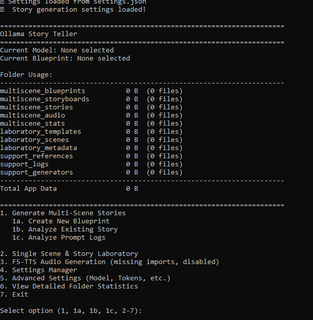
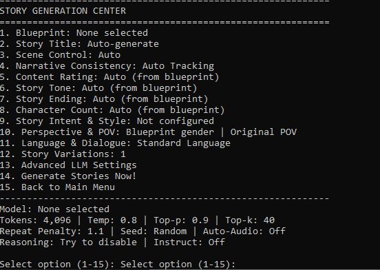
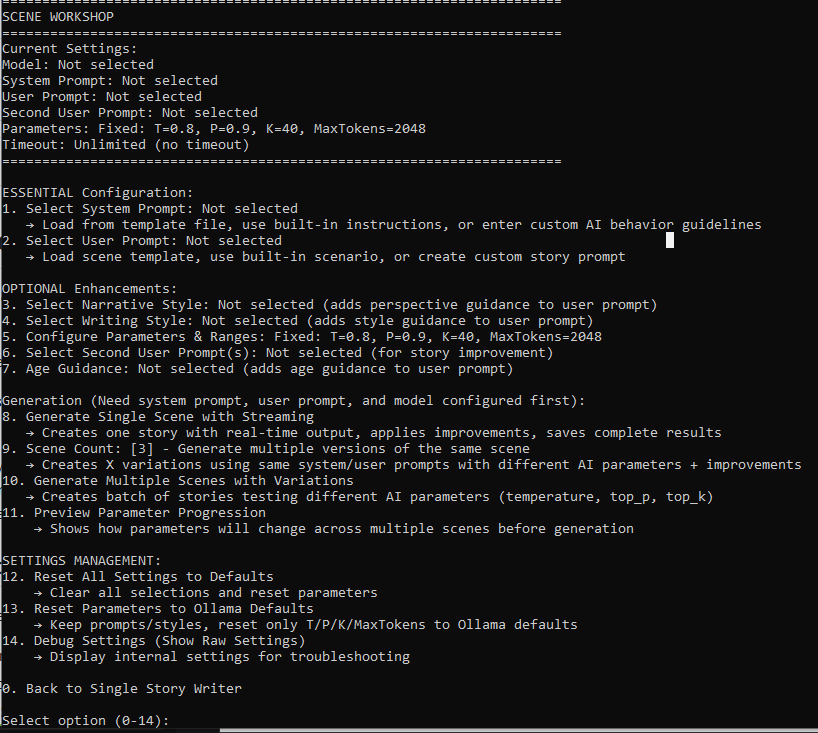

# Ollama Story Teller

I dont know mutch about python programming this app has been done by using easycode claude sonnet 4.
Most if this readme is done by ai.

This app uses ollama llm model to create storys.

This app has support for F5-tts, but it dosent install the import, imports can be installed later when you are going to use it.

An advanced AI-powered storytelling application that uses Ollama models to generate immersive, multi-scene stories with optional F5-TTS audio generation. The application features both multi-scene story generation and a single scene laboratory for testing and experimentation.

## Dependencies & Attribution

This application builds upon several excellent open-source projects:

- **[Ollama](https://github.com/ollama/ollama)** - Local LLM inference server that powers the story generation
- **[F5-TTS](https://github.com/SWivid/F5-TTS)** - Advanced text-to-speech synthesis for audio story generation (optional)
- **[Gradio Client](https://github.com/gradio-app/gradio)** - Used for F5-TTS integration

**Note**: This is a third-party application that integrates with Ollama and F5-TTS. Please ensure you have Ollama installed and running locally before using this application.

## Features

- **Multi-Scene Story Generation**: Create complex stories with multiple scenes using story blueprints
- **Single Scene Laboratory**: Test and experiment with individual scenes and story elements
- **F5-TTS Audio Integration**: Convert your stories to audio using F5-TTS (optional)
- **Advanced Settings**: Fine-tune model parameters, prompts, and generation settings
- **Story Analysis**: Analyze existing stories and prompt logs for insights
- **Blueprint System**: Create and manage reusable story templates
- **Comprehensive Logging**: Debug and optimize your story generation process

## Installation

1. **Prerequisites**:
   - Python 3.8+
   - Ollama installed and running locally
   - At least one Ollama model downloaded (e.g., `ollama pull llama2`)

2. **Download the Application**:
   ```bash
   git clone <repository-url>
   cd ollama-story-teller
   ```
3. **Create Virtual Environment**:

   **For Windows:**
   ```cmd
   # Create virtual environment
   python -m venv storyteller-env
   
   # Activate virtual environment
   storyteller-env\Scripts\activate
   
   # Install requirements
   pip install -r requirements.txt
   ```
   **For Linux/macOS:**
   ```bash
   # Create virtual environment
   python3 -m venv storyteller-env
   
   # Activate virtual environment
   source storyteller-env/bin/activate
   
   # Install requirements
   pip install -r requirements.txt
   ```
4. **Optional F5-TTS Support** (only install if you plan to use audio generation):

   **For Windows:**
   ```cmd
   # Make sure virtual environment is activated
   storyteller-env\Scripts\activate
   
   # Install F5-TTS dependencies
   pip install gradio-client==1.11.0 huggingface-hub==0.34.2
   ```
   **For Linux/macOS:**
   ```bash
   # Make sure virtual environment is activated
   source storyteller-env/bin/activate
   
   # Install F5-TTS dependencies
   pip install gradio-client==1.11.0 huggingface-hub==0.34.2
   ```
5. **Run the Application**:

   **For Windows:**
   ```cmd
   # Activate environment (if not already activated)
   storyteller-env\Scripts\activate
   
   # Run the application
   python app.py
   ```
   **For Linux/macOS:**
   ```bash
   # Activate environment (if not already activated)
   source storyteller-env/bin/activate
   
   # Run the application
   python app.py
   ```
### Future Usage

Once installed, you only need to:

1. **Activate your environment** and **run the app**:

   **Windows:**
   ```cmd
   cd ollama-story-teller
   storyteller-env\Scripts\activate
   python app.py
   ```
   **Linux/macOS:**
   ```bash
   cd ollama-story-teller
   source storyteller-env/bin/activate
   python app.py
   ```
### Notes:
- The virtual environment keeps your dependencies isolated from other Python projects
- F5-TTS dependencies are optional - skip step 4 if you don't need audio generation
- Make sure Ollama is running (`ollama serve`) before starting the application
## Quick Start Guide

### First Time Setup

1. **Launch the application**: `python app.py`
2. **Select a model**: Go to Advanced Settings (option 5) → Select Model
3. **Create or select a blueprint**: Use option 1a to create a new blueprint or select an existing one in Advanced Settings

### Multi-Scene Story Generation

The app generates parts of the story across various scenes, which may present different descriptions and details in each scene. This is beta of the app.

I have incorporated an option that allows users to select known locations. When this option is chosen, it will describe the place uniformly across all scenes of your story, ensuring that regardless of how many interconnected scenes you create, the description of the selected location remains consistent throughout your narrative.

Or you can you singel story with a llm model that has support for high token output.

#### What are Multi-Scene Stories?

Multi-scene stories consist of:
- **Story Bible**: The overarching world, characters, and themes
- **Scene Plan**: Detailed outline of how scenes connect and progress
- **Individual Scenes**: Fully developed story segments that build upon each other

#### How Multi-Scene Generation Works:

1. **Blueprint Selection**: Choose a `.story.txt` file from the `multiscene/blueprints/` folder
2. **Story Bible Generation**: AI creates the foundational world-building document
3. **Scene Planning**: AI develops a detailed plan for scene progression
4. **Scene Generation**: Each scene is generated with full context from previous scenes
5. **Audio Generation** (optional): Convert the complete story to audio using F5-TTS

#### Multi-Scene Workflow:

Story Blueprint → Story Bible → Scene Plan → Scene 1 → Scene 2 → ... → Complete Story

**Key Benefits**:
- **Consistency**: Each scene maintains character and world continuity
- **Depth**: Rich character development across multiple scenes
- **Flexibility**: Reuse story bibles and scene plans for variations
- **Quality**: AI has full context for each scene generation

#### Storyboard Reuse Modes:

- **Create new story bible & scene plan**: Fresh start for each generation
- **Reuse story bible, new scene plan**: Keep world/characters, new plot progression
- **Reuse story bible & scene plan**: Generate variations using same foundation

### Single Scene & Story Laboratory

The Laboratory is designed for experimentation, testing, and creating standalone scenes or short stories.

#### What is the Single Scene Laboratory?

The Laboratory provides:
- **Template System**: Reusable prompt templates for different story types
- **Scene Testing**: Generate and test individual scenes without multi-scene context
- **Model Comparison**: Test different models and settings on the same content
- **Rapid Prototyping**: Quickly iterate on story ideas and concepts

#### Single Scene vs Multi-Scene:

| Feature | Single Scene | Multi-Scene |
|---------|--------------|-------------|
| **Purpose** | Testing, experimentation, standalone scenes | Complete narrative experiences |
| **Context** | Self-contained | Builds on previous scenes |
| **Length** | Short scenes/stories | Full-length stories |
| **Complexity** | Simple, focused | Complex, layered narratives |
| **Use Case** | Prototyping, model testing, quick stories | Main storytelling feature |

#### When to Use Single Scene:

- **Testing new models** or settings before using in multi-scene
- **Experimenting** with different prompt styles
- **Creating standalone scenes** or short stories
- **Rapid prototyping** of story concepts
- **Educational purposes** to understand how different settings affect output

## File Structure

The application organizes content into two main areas:

### Multiscene Organization
```
multiscene/ 
├── blueprints/ # Story blueprint templates (.story.txt files) 
├── storyboards/ # Generated story bibles and scene plans 
├── stories/ # Complete multi-scene stories 
├── audio/ # Generated audio files 
└── stats/ # Generation statistics and metadata
```
### Laboratory Organization
```
laboratory/ 
├── templates/ # Prompt templates for single scenes 
├── scenes/ # Generated single scenes and test content 
└── metadata/ # Prompts, statistics, and test results
```
## Creating Story Blueprints

Story blueprints are the foundation of multi-scene stories. Create `.story.txt` files in the `multiscene/blueprints/` folder, you can edit them in a text editor.

### Blueprint Format:

TITLE: Your Story Title GENRE: Fantasy/Sci-Fi/Romance/etc. STYLE: Narrative style description SCENES: Number of scenes (e.g., 3-5)

PREMISE: Brief description of the main story concept...

CHARACTERS:

Character 1: Description
Character 2: Description
SETTING: Description of the world/location...

THEMES: Key themes to explore...

PLOT_POINTS:

Opening situation
Key developments
Climax/resolution

## Advanced Features

### Model Settings
- **Temperature**: Controls creativity (0.1-2.0)
- **Top-p/Top-k**: Fine-tune token selection
- **Max Tokens**: Control story length


### Audio Generation (F5-TTS)
- Convert stories to natural-sounding audio
- Customizable voice references
- Automatic audio generation option
- Cross-fade and timing controls

### Story Analysis
- Analyze existing stories for patterns and insights
- Review prompt logs for optimization
- Generate detailed statistics and reports

## Tips for Best Results

### Multi-Scene Stories:
1. **Create detailed blueprints** with rich character and world descriptions
2. **Use appropriate scene counts** (3-7 scenes work well)
3. **Enable storyboard reuse** to create variations of successful stories
4. **Review generated story bibles** before proceeding to scene generation

### Single Scene Laboratory:
1. **Start with templates** to understand effective prompting
2. **Test model settings** before applying to multi-scene generation
3. **Use for rapid iteration** on specific story elements
4. **Compare different approaches** to find what works best

### General Tips:
1. **Monitor token usage** - longer contexts may reduce quality
2. **Experiment with temperature** - lower for consistency, higher for creativity.
3. **Enable logging** to understand and improve your prompting or find errors in the code.

## Troubleshooting

### Common Issues:

1. **No models available**: Ensure Ollama is running (`ollama serve`)
2. **Poor story quality**: Try adjusting temperature or using different models
3. Too short stories: normal llm output token is about 500-800 tokens, use different llm that has high token limit.

### Getting Help:

- Check the `support/logs/` folder for detailed error information
- Enable debug logging in Advanced Settings
- Review generated storyboards to understand AI reasoning
- Use the Single Scene Laboratory to test settings before multi-scene generation


 ## Citation
> If you use F5-TTS in your work, please cite:

@article{chen-etal-2024-f5tts,
      title={F5-TTS: A Fairytaler that Fakes Fluent and Faithful Speech with Flow Matching}, 
      author={Yushen Chen and Zhikang Niu and Ziyang Ma and Keqi Deng and Chunhui Wang and Jian Zhao and Kai Yu and Xie Chen},
      journal={arXiv preprint arXiv:2410.06885},
      year={2024},
}

**Happy Storytelling!**"# Ollama-Story-Teller" 
